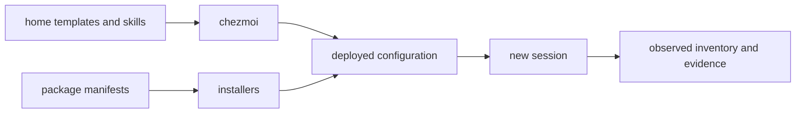

Use this guide to change or evaluate the managed stack. For day-to-day operation, start with the [AI workbench](../usage/ai-workbench.md).

## Choose an agent

| Agent | Choose it for | Managed configuration |
| --- | --- | --- |
| [Codex](codex.md) | profile-led implementation, focused child roles, and managed MCP profiles | [`home/dot_codex/`](../../home/dot_codex/) |
| [Claude Code](claude.md) | plugin/hook workflows and source-grounded or adversarial local roles | [`home/dot_claude/`](../../home/dot_claude/) |
| [Cursor](cursor.md) | IDE/Agents Window, Composer 2.5 subagents, and self-hosted computer use | [`home/dot_cursor/`](../../home/dot_cursor/) |
| [OpenCode](opencode-and-pi.md) | generated MCP namespaces and a constrained review agent | [`home/dot_config/opencode/`](../../home/dot_config/opencode/) |
| [Pi](opencode-and-pi.md) | its rendered local-MLX or declared cloud-provider setup | [`home/dot_pi/agent/`](../../home/dot_pi/agent/) |

Choose the harness whose configuration and interaction model suit the task, then inspect the active session before relying on its tools or account state.

## Start from the source of truth

Edit the declared input, then render or reconcile it. Repairs inside `~/.codex` or an installed skill directory do not survive sync.

| Need | Start here | It does not establish |
| --- | --- | --- |
| Change guidance | [Instruction architecture](instructions.md) | Tool, account, or permission availability |
| Add a capability | [Inventories and ownership](inventories.md) | A live or authorized service |
| Select Codex routing | [Profiles and roles](codex.md) | A sandbox or guaranteed savings |
| Assess a result | [Validation](validation.md) | Correctness beyond the performed check |

Instructions govern reasoning; skills provide procedures; MCP servers provide configured tool routes; plugins provide marketplace extensions. None independently proves a login, a live service, or permission for an external action.

## A disciplined task loop

1. Read project instructions and inspect the worktree.
2. Pick the narrowest profile and skill that fit.
3. Use a direct command for deterministic work; delegate only an independent bounded unit.
4. Keep the command, artifact, and assertion together.
5. Exercise the result in its consumer and state what that observation does and does not prove.

For persistent state, use [browser workspaces](../usage/browser-sessions.md) or [durable tasks](../usage/durable-tasks.md). For an interface-specific route, see [browser and desktop evidence](automation-evidence.md) or [domain workflows](domain-workflows.md).
