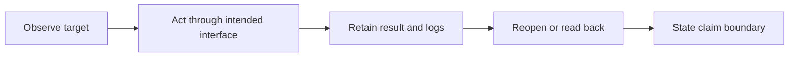

## Match the interface to the target

| Target | Use | Retain | Does not prove |
| --- | --- | --- | --- |
| Local web UI | Playwright CLI or `browser-workbench` | interaction result, screenshot, failure trace | production or account access |
| Authenticated tab | explicit attachment or native browser control | fresh selected-tab observation | normal-profile access or session transfer |
| Native macOS app | Computer Use, `desktop-workbench`, or app API | live state and reopened export | ungranted privacy or app permission |
| App-owned agent action | `webmcp-workbench` | discovery, invocation, visible result | global MCP/client support |
| Scriptable service | project CLI or API | request/response and readback | UI behavior or third-party deployment |

## Use private browser workspaces for persistent service state

[`df-browser`](../usage/browser-sessions.md) owns a project/service/host Playwright workspace and keeps profiles, traces, screenshots, and explicit storage exports outside the repository.

```bash
df-browser open dashboard http://127.0.0.1:3000 --headed
df-browser run dashboard snapshot
df-browser screenshot dashboard logged-in-home
df-browser check dashboard --selector '[data-testid="account-menu"]'
df-browser close dashboard
```

Expected result: the check reports the marker in that private workspace. It cannot prove the service will retain a session after revocation or refresh. See [browser workspace lifecycle](../usage/browser-sessions.md).

## Keep evidence proportional



Keep the interaction path and target viewport for browser work; reopen creative and desktop outputs; use authoritative readback for MCP writes. An image proves a moment, a trace supports interaction/network claims, and a local run proves that local environment. They do not automatically prove deployment, physical hardware, privacy, third-party state, or approval.

## Apply native automation carefully

Inspect the live window before acting. Prefer application APIs for repeatable controlled mutations; use coordinate playback only with recovery for already-open files or exports. The `desktop` profile exposes tools but grants neither Accessibility, Automation, screen recording, app entitlements, browser login, SSO, MFA, nor purchase authority.

## Current references

Use [Playwright sessions](https://playwright.dev/agent-cli/sessions), [extension attachment](https://playwright.dev/agent-cli/commands/attach), and the local [WebMCP workbench](../usage/webmcp.md). Verify client support live before promising a WebMCP route.
