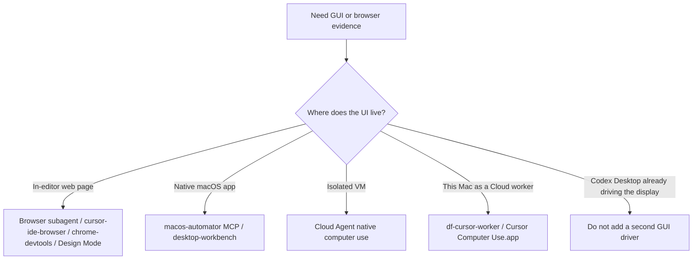

Configure the Cursor IDE, Agents Window, CLI, and self-hosted My Machines worker from this repository. Cloud VMs still need dashboard MCP and an optional User Rules copy; they do not read `~/.cursor/mcp.json` or user hooks.

## Know which layer owns the behavior

| Concern | Source | Inspect |
| --- | --- | --- |
| Shared instructions | [`cursor-agents.md`](../../home/.chezmoitemplates/cursor-agents.md), [`AGENTS.md.tmpl`](../../home/dot_cursor/AGENTS.md.tmpl) | `chezmoi cat ~/.cursor/AGENTS.md` |
| Always-on Cursor rule | [`rules/personal.mdc.tmpl`](../../home/dot_cursor/rules/personal.mdc.tmpl) | `~/.cursor/rules/personal.mdc` |
| Cloud User Rules | Cursor Settings → Rules (upserted from the same body) | Settings UI; max 20000 characters |
| Subagents | [`home/dot_cursor/agents/`](../../home/dot_cursor/agents/) | `~/.cursor/agents/` |
| Skills | [`symlink_skills`](../../home/dot_cursor/symlink_skills) → `~/.claude/skills` | `readlink ~/.cursor/skills` |
| MCP (this Mac) | [`mcp-servers.txt`](../../packages/mcp-servers.txt) via [`cursor.sh`](../../install/cursor.sh) | `jq . ~/.cursor/mcp.json` |
| MCP (Cloud / Autopilot) | [cursor.com/agents](https://cursor.com/agents) | Cloud session inventory |
| CLI default + permissions | [`create_cli-config.json`](../../home/dot_cursor/create_cli-config.json) + installer merge | `jq '{model,selectedModel,exploreSubagentModel,permissions}' ~/.cursor/cli-config.json` |
| My Machines worker | [`df-cursor-worker`](../../home/dot_local/bin/executable_df-cursor-worker), [`dev.cade.cursor-worker.plist.tmpl`](../../home/Library/LaunchAgents/dev.cade.cursor-worker.plist.tmpl) | `agent worker debug`; `launchctl print gui/$(id -u)/dev.cade.cursor-worker` |

Project `AGENTS.md` still owns repository build, test, and deployment work. Cursor captures settings edits instead of blocking them with the chezmoi guard.

## Check the harness

Prerequisite: macOS with Cursor installed, `chezmoi apply` completed, and the `agent` CLI signed in (`agent status`).

```bash
bash ~/dotfiles/install/cursor.sh check
```

Expected result: hooks, MCP, `AGENTS.md`, the always-apply rule, Composer 2.5 agents, the skills symlink, `Shell(*)`, `exploreSubagentModel`, and `selectedModel.modelId` / `model.modelId` all pass as `composer-2.5`. On Darwin with `DF_CURSOR_WORKER` not `0`, the LaunchAgent is loaded. The check does not prove Accessibility or Screen Recording grants, and it does not change this IDE chat's model picker.

`df-agent-doctor` runs this check on Darwin.

## Default to Composer 2.5

The Agent CLI default is `composer-2.5` (standard, not Fast). `install/cursor.sh` pins `selectedModel.modelId`, `model.modelId`, `hasChangedDefaultModel`, and `exploreSubagentModel` on every merge. `agent --list-models` must list that id for the signed-in account.

The IDE chat picker is **not** a `settings.json` key. It lives in Cursor app storage. An already-open chat keeps the model it started with. Pick **Composer 2.5** once in the model dropdown for new IDE chats; that is the accept step for this window.

## Delegate on Composer 2.5

Custom agents in `~/.cursor/agents/` pin `model: composer-2.5`. Built-in Explore, Bash, and Browser stay product-owned; do not recreate them.

| Agent | Use | Limit |
| --- | --- | --- |
| `researcher` | live primary-source questions | read-only |
| `reviewer` | adversarial review after implementation | read-only |
| `verifier` | confirm claimed work actually runs | may write artifacts; no app-source edits unless asked |
| `debugger` | failing reproduction and a minimal fix | not a permission boundary |

A role description is not a sandbox. `Shell(*)` is unrestricted.

## Computer use — one driver per task



Self-hosted full computer use is the My Machines worker:

```bash
# loaded by install/cursor.sh on Darwin unless DF_CURSOR_WORKER=0
launchctl print "gui/$(id -u)/dev.cade.cursor-worker"
agent worker debug
```

The wrapper runs `agent worker --computer-use --wait --idle-release-timeout 0`.
Only one daemon can own `~/.local/share/cursor-agent`; `--wait` blocks until
Cursor's in-app worker exits rather than crash-looping. The first start
installs `~/.cursor/cursor-computer-use/Cursor Computer Use.app` (`co.anysphere.cursor-computer-use`). Grant **Accessibility** and **Screen Recording** to that helper app, not to Terminal or Cursor.app. Sequoia and later may re-prompt Screen Recording periodically. This repository does not write TCC.db.

Optional runtime env (not baked into chezmoi templates):

| Var | Default | Effect |
| --- | --- | --- |
| `DF_CURSOR_WORKER` | `1` when Cursor setup runs on macOS | `0` bootouts and disables the LaunchAgent |
| `DF_CURSOR_WORKER_NAME` | `hostname -s` | My Machines worker name |
| `DF_CURSOR_WORKER_DIRS` | empty | extra colon-separated `--worker-dir` paths |

`--share-desktop` is Linux-only and is not used here. Linux skips the worker (`DF_DO_CURSOR` already defaults to `0`).

## Skills and Cloud

`~/.cursor/skills` is a symlink to `~/.claude/skills`. One tree, one writer per directory. Cloud skill sync only copies `~/.cursor/skills`; turn on **Sync Skills for Cloud Agents** in Settings when a Cloud run needs that tree. User hooks in `~/.cursor/hooks.json` do not run on Cloud VMs.

## CLI config merge

`home/dot_cursor/create_cli-config.json` is write-once. `install/cursor.sh` then merges `Shell(*)`, Composer 2.5 as the selected/default model, and `exploreSubagentModel: composer-2.5` into the live `~/.cursor/cli-config.json`, preserving sandbox, attribution, extra `model` object fields, and `authInfo`. A fully managed file would clobber those keys on the next `chezmoi apply`. The running Cursor app may rewrite `selectedModel` and `permissions` after merge — re-run `bash install/cursor.sh sync-cli`.

## Limits

- The IDE model picker is app storage, not `settings.json`. This open chat does not switch until you pick Composer 2.5.
- Cloud `/in-cloud` and `/autopilot` sessions use dashboard MCP, not this repo's `mcp.json`.
- User Rules duplicate the local `AGENTS.md` so Cloud gets prefs; keep the body under 20000 characters.
- `agent worker debug` does not prove TCC grants. A screenshot task that fails with Computer use Ready: no needs a human grant to **Cursor Computer Use**.
- Only one worker daemon can own `~/.local/share/cursor-agent`. The LaunchAgent waits (`--wait`) rather than fighting Cursor's in-app worker.
- Loading the LaunchAgent does not fail bootstrap when the helper app or TCC is missing.
- Codex `~/.codex/agents/*.toml` is a different format; do not port it.

## Official reference

- [Subagents](https://cursor.com/docs/subagents)
- [Rules](https://cursor.com/docs/rules)
- [Skills](https://cursor.com/docs/skills)
- [Cursor CLI](https://cursor.com/docs/cli/overview)
- [Computer use](https://cursor.com/docs/cloud-agent/self-hosted/computer-use)
- [My Machines](https://cursor.com/docs/cloud-agent/self-hosted/my-machines)
