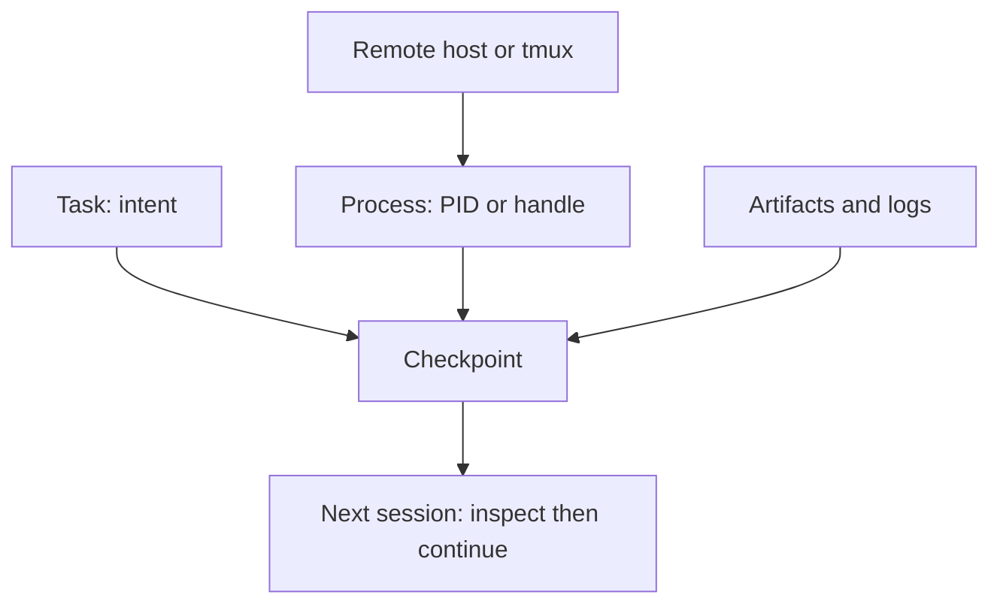

## Checkpoint work that must survive a session

`df-task` records native-session checkpoints plus job, log, and artifact registrations. It does not spawn, detach, stop, retry, or infer continuing work.

Run inside a Codex session with `CODEX_THREAD_ID` set, or add `--session ID` using the native session ID. Register paths from your actual run.

```bash
df-task start --title "Validate the import flow" --next "Run the focused browser fixture" \
  --artifact ./artifacts/import.png --log ./artifacts/import.log
df-task checkpoint --note "Fixture reaches confirmation; export needs reopen check" \
  --next "Open the export in the consumer" --artifact ./out/export.glb
df-task status
```

Expected result: the checkpoint lists your next step, logs, and artifacts. To track an existing process, use `df-task job build --pid PID --log ./build.log` with its real PID. PID rechecking distinguishes the original process from a reused PID.

## Resume conservatively

```bash
df-task list
df-task resume --session <native-session-id>
df-task resume --session <native-session-id> --launch
```

The first two commands show saved state and its native resume command. `--launch` opens that command in its recorded directory; it does not submit a prompt or restart a job. Restore a missing worktree explicitly. See [Durable Codex tasks](../usage/durable-tasks.md).

## Separate task, process, and remote host



Record host, command, input revision, output path, last passing check, and inspection command. An agent task, OS process, remote host, SSH connection, `tmux` server, browser, and cloud job are separate stateful systems.

## Keep remote claims narrow

SSH proves the command ran on that host; it does not prove a GUI, durable credentials, propagation, or hardware execution. A cloud MCP profile similarly configures a route, not OAuth, IAM, enabled APIs, or an external write. Restart after MCP or secret changes, and pair claims with current observations. See [Google Cloud MCP credentials](../usage/google-cloud-mcp.md).

## Hooks are checkpoint signals, not an autonomous scheduler

Managed Codex hooks call `df-task hook` at lifecycle events with short timeouts. They record state; they do not decide continuation, restart cancelled jobs, or resume work. Use `long-running-work` with the checkpoint record for a sustained plan.

Lifecycle hooks reuse the host's already resolved `PYTHON_ENV` when it names an
executable Python runtime. Their POSIX shell launcher avoids Bash's additional
noninteractive SSH startup. Other `df-task` commands still resolve host policy
before launching. The host resolver uses one Bash export-name snapshot or direct
Zsh parameter metadata instead of starting a process for every policy key.

Codex normally uses the task environment's non-login shell for hooks; its default
shell fallback is a login shell. These paths have different startup costs, so
validate lifecycle events through the native app-server rather than assuming a
manual `bash -lc` timing describes the active path. The regression test completes
a turn against a local model fixture and checks `SessionStart`, `Stop`, and
`SessionEnd`. Three-second lifecycle limits remain unchanged; Codex itself caps
`Interrupt` and `SessionEnd` at three seconds. Checkpoint lock acquisition stops
after 200 ms.

Checkpoints use `DF_TASK_STATE_DIR` when explicitly set; otherwise they live in
`$DF_STATE_ROOT/dotfiles/tasks/<host-id>`. Without `DF_STATE_ROOT`, the base is
`XDG_STATE_HOME` or `~/.local/state`. Keep `DF_STATE_ROOT` on local storage for a
remote host. Existing records at the old XDG location remain readable and are
copied on their first update under the destination lock. A destination record
always wins; the old file is retained. An explicit `DF_TASK_STATE_DIR` isolates
that directory and never falls back to old records.

After updating dotfiles, run `bash ~/dotfiles/install/codex.sh sync-runtime` on
each host to install the helper. These helper changes take effect on the next
hook invocation without restarting Codex or resubmitting work.
