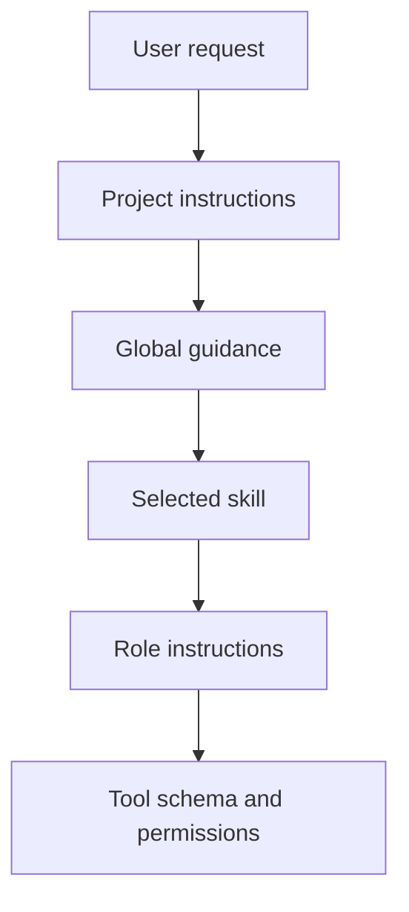

## Resolve instruction precedence before editing

More specific applicable guidance can refine broader guidance; the current user request remains authoritative. Tool schemas and permissions are runtime constraints, not prose preferences.



A project `AGENTS.md` can add a test route without replacing the requested phase. A role can narrow its assignment but cannot grant tools or bypass approval policy.

## Edit sources, then render

| Purpose | Source | Target | Apply |
| --- | --- | --- | --- |
| Shared engineering guidance | [`agents-common.md`](../../home/.chezmoitemplates/agents-common.md) | harness wrappers | `chezmoi apply` |
| Shared voice | [`voice-common.md`](../../home/.chezmoitemplates/voice-common.md) | Codex/OpenCode/Pi/Cursor directly; Claude output style | `chezmoi apply` |
| Codex global guidance | [`AGENTS.md.tmpl`](../../home/dot_codex/AGENTS.md.tmpl) | `~/.codex/AGENTS.md` | `chezmoi apply ~/.codex/AGENTS.md` |
| Claude global guidance | [`CLAUDE.md.tmpl`](../../home/dot_claude/CLAUDE.md.tmpl) | `~/.claude/CLAUDE.md` | `chezmoi apply ~/.claude/CLAUDE.md` |
| Cursor global guidance | [`AGENTS.md.tmpl`](../../home/dot_cursor/AGENTS.md.tmpl), [`cursor-agents.md`](../../home/.chezmoitemplates/cursor-agents.md) | `~/.cursor/AGENTS.md`, `~/.cursor/rules/personal.mdc` | `chezmoi apply ~/.cursor/AGENTS.md` |
| Codex roles/hooks | [`agents`](../../home/dot_codex/agents/), [`hooks.json`](../../home/dot_codex/hooks.json) | `~/.codex/agents/`, `~/.codex/hooks.json` | `bash install/codex.sh sync-config` |

The Codex installer owns generated role files and scopes. Do not edit deployed `~/.codex/agents/*.toml`; see [`install/codex.sh`](../../install/codex.sh) and [`install/codex-config.py`](../../install/codex-config.py).

## Keep global text durable and scoped

Put cross-project authorization, evidence, language, and failure behavior in the common partial; client behavior in a client wrapper; project conventions in project instructions; reusable procedures in skills. For example, keep this next to a Rust project:

```md
## Validation
Run `cargo nextest run` after changing Rust behavior. Do not claim a physical-device result from the simulator.
```

## Change and test an instruction deliberately

1. Name the target layer and realistic expected behavior.
2. Edit one owner, render it, and inspect expansion/links.
3. Compare baseline and candidate tasks with identical model, effort, inputs, and tools.
4. Retain instruction fingerprint, artifacts, verifier result, usage, and parent rework.

Use [`writing-skills`](../../home/dot_claude/skills/writing-skills/SKILL.md) for meaningful comparisons. Prompt size or one successful sample does not establish quality, latency, or cost. Check current [Codex configuration](https://learn.chatgpt.com/docs/config-file/config-reference) before new settings.
