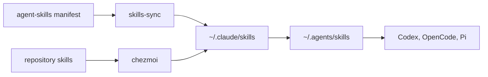

## Use the right extension mechanism

| Mechanism | Owner | Supplies | Reconcile/check |
| --- | --- | --- | --- |
| MCP registry | [`mcp-servers.txt`](../../packages/mcp-servers.txt) | endpoint, profile, risk, auth reference | `bash install/codex.sh sync-config`; `check` |
| Codex plugins | [`codex-plugins.txt`](../../packages/codex-plugins.txt) | marketplace inventory | `bash install/codex.sh sync-config` / `check` |
| Claude plugins | [`claude-plugins.txt`](../../packages/claude-plugins.txt) | plugins, commands, agents, or skills | `bash install/claude.sh install` |
| Installer skills | [`agent-skills.txt`](../../packages/agent-skills.txt) | shared skill receipts/digests | `bash install/skills-sync.sh check` |
| Repository skills | [`home/dot_claude/skills/`](../../home/dot_claude/skills/) | versioned procedures/assets | `chezmoi apply` |

Configured capability is not a successful login, live endpoint, or authority to mutate an external system.

## Preserve the one-owner rule

A skill belongs either in `packages/agent-skills.txt` or `home/dot_claude/skills/`, never both. The deployed tree is `~/.claude/skills`, linked as `~/.agents/skills` for Codex, OpenCode, and Pi.



`bash install/skills-sync.sh check` is read-only. Do not use `npx skills check` as an audit: it may update installed skills.

## Add an MCP deliberately

```text
chrome-devtools stdio profile=browser risk=external-write cmd: npx -y chrome-devtools-mcp@1.8.0 --no-usage-statistics --no-performance-crux
```

That line declares transport, profile, risk, and command. It does not start Chrome or grant an account permission. Read the registry header and [`install/codex.sh`](../../install/codex.sh), regenerate configuration, start a new task, inspect its tools, and exercise a harmless read when supported.

## Plugin inventory is separate

Codex entries use `PLUGIN@MARKETPLACE`. The installer distinguishes missing/disabled declarations from unavailable upstream items. Do not make an unlisted local install permanent; declare it through its approved owner. Claude marketplace coupling is documented in [`claude-plugins.txt`](../../packages/claude-plugins.txt). See [cross-harness agent guidance](../usage/agents.md).

## Credentials and authority remain separate

Registry auth names (`gh`, Google ADC relay, or environment-variable references) are not a credential vault. Use [authentication setup](../setup/auth.md), test a fresh session, and keep secret exports outside the repository. Remote writes, purchases, consent, OS privacy, and MFA remain external boundaries.
