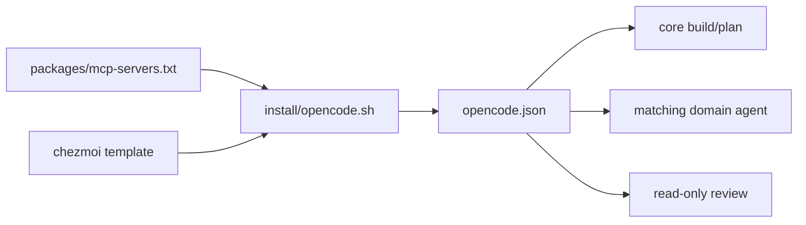

## Start with the generated configuration

OpenCode JSON is installer-rendered; Pi settings and models are chezmoi-rendered. Both may use local MLX on macOS and declared cloud defaults on Linux, so inspect generated configuration before assuming a model or connection.

| Harness | Sources | Target | Check |
| --- | --- | --- | --- |
| OpenCode | [`template`](../../home/dot_config/opencode/create_private_opencode.json.tmpl), [`AGENTS`](../../home/dot_config/opencode/AGENTS.md.tmpl), [`installer`](../../install/opencode.sh) | `~/.config/opencode/opencode.json` | `bash ~/dotfiles/install/opencode.sh check` |
| Pi | [`settings`](../../home/dot_pi/agent/settings.json.tmpl), [`models`](../../home/dot_pi/agent/models.json.tmpl), [`AGENTS`](../../home/dot_pi/agent/AGENTS.md.tmpl) | `~/.pi/agent/` | `pi --version` |

The macOS endpoint is `http://localhost:8080/v1` and must run separately. Credentials and interactive login are separate from checked-in configuration; do not use `/login` to diagnose an endpoint.

## OpenCode scopes agents by MCP namespace

The sync renders registry servers, preserves allowed runtime choices, and creates core plus `research`, `browser`, `creative`, `desktop`, `cloud`, `workspace`, `math`, and `repository` agents.

`review` denies edit/task and has a small Bash allowlist (`git diff`, `git log`, `git show`, `rg`, `fd`); it is for reviewing a change, not deployment validation or host isolation. `sync-config` writes configuration; `check` parses and reports MCP count without reconciling. Start a new session after a sync.

## Extensions are adapters, not a new policy engine

| Extension | Event | Effect | Limit |
| --- | --- | --- | --- |
| `chezmoi-guard.ts` | edit/write | asks `df-chezmoi-guard` about path/patch | unavailable guard fails open |
| `rtk.ts` | shell/Bash | applies known `rtk rewrite` result | unknown/failed rewrite passes through |

OpenCode’s [`git-context.ts`](../../home/dot_config/opencode/plugin/git-context.ts) shows status and five recent commits at session start; it is context, not worktree inspection. Pi probes both helpers at load; its RTK path enforces the documented minimum version and honors `RTK_DISABLED=1`. Neither adapter makes a token-reduction claim; see [agent overhead](../usage/agent-overhead.md).

## Recovery and limits

Inspect `opencode logs` or client diagnostics, then generated JSON, before changing sources. For a missing local endpoint, follow the local-model route; for absent MCP scope, deliberately sync, inspect namespaces, and start a new session. Managed settings suppress automatic sharing/updates, but they do not authenticate services, make external MCPs read-only, or restrain an allowed shell command. Check current [OpenCode configuration](https://opencode.ai/docs/config/) and [Pi documentation](https://pi.dev/docs) before schema changes.
