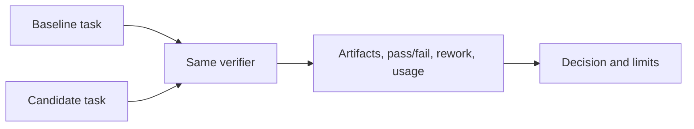

## Test three separate things

| Assertion | Check | Does not prove |
| --- | --- | --- |
| Source renders | render/apply and inspect target | harness loaded it |
| Client accepts config | `bash install/codex.sh check`, `bash install/cursor.sh check`, and focused tests | endpoint reachability or task quality |
| Task behavior improved | representative artifact + independent verifier | general gain from one sample |
| Role routed | observed model/effort and inventory | lower total cost or universal correctness |
| MCP action available | fresh-session inventory + harmless call | broader authentication or write authority |

## Validate the managed Codex path

```bash
bash install/codex.sh sync-config
bash install/codex.sh check
bash install/cursor.sh check
bash install/skills-sync.sh check
```

Expected result: generated Codex configuration passes; the final skill command reports drift without changing it. Start a new task before inspecting profiles or roles. Use `./tests/ci.sh full` for broad repository changes and `./tests/run.sh` for Docker bootstrap behavior; write bulky output to an artifact.

## Evaluate instruction and skill changes with paired tasks

Keep model/effort, prompt, revision, inputs, tools, acceptance checks, artifact path, and verifier constant. Record configuration fingerprint, routing, artifacts, result, usage, failures, and parent rework.



Do not attribute a different model, task, or unverified output to instruction quality. Smaller prompts and cheaper children are not performance results by themselves. Use [`writing-skills`](../../home/dot_claude/skills/writing-skills/SKILL.md) for the full comparison route.

## Retain evidence that a reviewer can inspect

Keep machine-readable large logs, UI screenshots/traces, and a project work log for sustained tasks. Report commands, exit status, artifact paths, observed gaps, and failure evidence. Verifiers must not weaken tests or edit sources to turn failure into pass. For docs-only work, use the book’s rendering/link path; cross-check scripts before documenting code or installer behavior. See [validation before publishing](../usage/validation.md).

## Report limits plainly

Say what ran: “the generated role parsed and the fixture passed,” “the interaction completed in this local profile,” or “the source supported this setting on its retrieval date.” Do not expand that claim without corresponding evidence.
