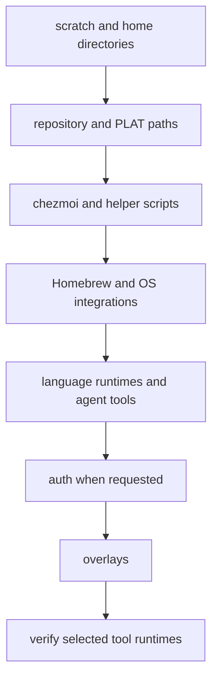

## Modes and stage order

Run a checked-out copy so the source and revision are explicit:

```bash
git clone https://github.com/cadebrown/dotfiles "$HOME/dotfiles"
cd "$HOME/dotfiles"
./bootstrap.sh                 # install
./bootstrap.sh update          # fast-forward pull, apply, refresh
./bootstrap.sh upgrade         # update plus managed runtime upgrades
```

The three accepted modes are enforced near the top of
[`bootstrap.sh`](https://github.com/cadebrown/dotfiles/blob/main/bootstrap.sh#L95).
`upgrade` enables Homebrew upgrade behavior; it does not perform operating
system updates. An update refuses a non-fast-forward pull rather than running
installers against a stale checkout
([source](https://github.com/cadebrown/dotfiles/blob/main/bootstrap.sh#L287)).



The concrete stage sequence is visible in the
[orchestrator](https://github.com/cadebrown/dotfiles/blob/main/bootstrap.sh#L204).
Each optional component has a `DF_DO_*` switch; for example, a constrained
setup can defer local models, desktop integrations, and authentication without
changing the source tree:

```bash
DF_PROFILE=core DF_DO_AUTH=0 DF_DO_LOCAL_LLM=0 ./bootstrap.sh
```

`DF_PROFILE` only accepts `core` or `full`; the shared contract also makes the
local-LLM default profile-sensitive
([source](https://github.com/cadebrown/dotfiles/blob/main/install/_lib.sh#L84)).

## Failure and degradation behavior

The main script runs with `set -euo pipefail`, so required stage failures stop
the run. It also records non-fatal installer warnings in a degradation log and
prints a collapsed summary even when a later stage fails
([source](https://github.com/cadebrown/dotfiles/blob/main/bootstrap.sh#L155)).
Treat that summary as incomplete work, not a successful installation.

Useful recovery starts with the named installer or documented symptom, then
re-runs the normal lifecycle once the cause is fixed:

```bash
bash install/verify-tools.sh
./bootstrap.sh update
```

`verify-tools.sh` checks only components selected by the same gates, including
managed executable locations and small smoke tests
([source](https://github.com/cadebrown/dotfiles/blob/main/install/verify-tools.sh#L46)).
For symptom-to-cause repairs, use the [troubleshooting guide](/usage/troubleshooting/);
for repository validation, use [validation](/usage/validation/).
