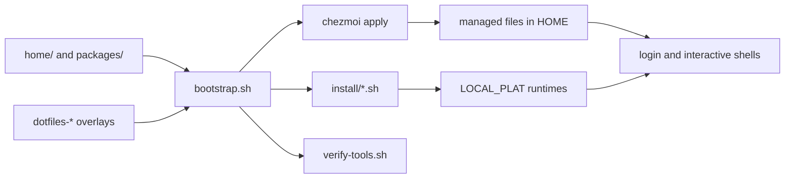

## The source-to-runtime model

This repository separates what is versioned from what is installed. `home/` is
the [chezmoi source tree](https://www.chezmoi.io/user-guide/manage-machine-to-machine-differences/);
it renders login profiles, editor settings, and managed agent configuration into
the home directory. `packages/` declares package-manager ownership. `install/`
turns those manifests into idempotent machine state. `bootstrap.sh` orders those
operations and checks selected runtime postconditions.

The bootstrap obtains its own paths by sourcing
[`install/_lib.sh`](https://github.com/cadebrown/dotfiles/blob/main/install/_lib.sh#L78),
which in turn establishes the platform contract. It deliberately applies
chezmoi with scripts excluded: installer stages own setup, while `chezmoi`
owns rendered files. See [bootstrap setup](/setup/bootstrap/) for the commands
and [chezmoi sources](/setup/chezmoi/) for editing the deployed configuration.

## State boundaries

| Kind of state | Authoritative location | Resulting location |
|---|---|---|
| Dotfiles and templates | `home/` | managed paths below `HOME` |
| Package declarations | `packages/` | Homebrew, Cargo, npm, uv, Go state |
| Installer logic | `install/` | local tools and service wiring |
| Host-specific data | chezmoi data and environment | never copied back into `home/` |
| Optional private extensions | sibling `dotfiles-*` directories | their own bootstrap lifecycle |

Do not edit a rendered `~/.zprofile`, `~/.config`, or `~/.codex` file as the
durable change. Edit its source under `home/`, then use `chezmoi diff` to view
the proposed deployment. The root map names these boundaries and the common
entrypoints in [REPO-MAP.md](https://github.com/cadebrown/dotfiles/blob/main/REPO-MAP.md#L1).

## What bootstrap does and does not prove

Bootstrap verifies that selected command paths exist and that a small number of
runtime probes work; the final gate is
[`verify-tools.sh`](https://github.com/cadebrown/dotfiles/blob/main/install/verify-tools.sh#L46).
It does not prove that a cloud credential works, that an optional local model
is running, or that a graphical application has its privacy permissions. Those
are separate operational checks. The [architecture pages](./bootstrap-lifecycle.md)
describe failure behavior and [workflow pages](../workflows/new-machines.md)
show practical machine bring-up paths.
