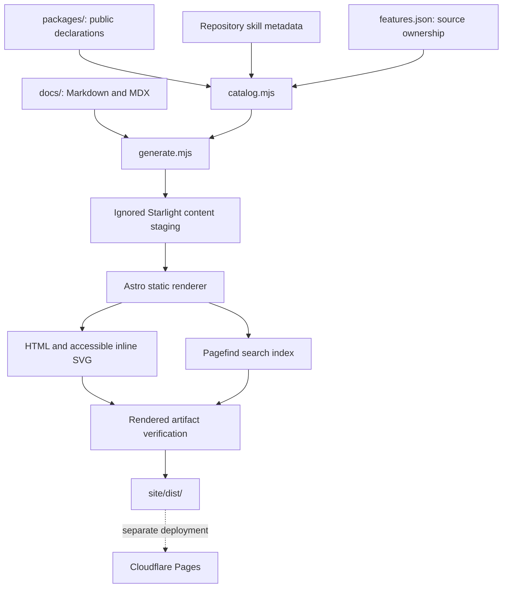

## A static site with executable documentation checks

The handbook uses **Astro 7 + Starlight 0.42**, Markdown/MDX, and TypeScript. It builds into static HTML, CSS, small interaction scripts, and a Pagefind search index. Cloudflare Pages serves `site/dist/`; reading documentation requires no application server or database.

The pinned versions and complete dependency graph live in [package.json](https://github.com/cadebrown/dotfiles/blob/main/site/package.json) and [package-lock.json](https://github.com/cadebrown/dotfiles/blob/main/site/package-lock.json). Use `npm ci --ignore-scripts` to reproduce them. Chromium is installed explicitly for server-side diagram rendering.



## Source contracts

| Input | Transformation | Published result |
| --- | --- | --- |
| `docs/**/*.md`, `*.mdx` | Stage content; derive metadata for older Markdown | Guides with navigation, outline, and edit links |
| `docs/usage/troubleshooting.md` | Split each H2 diagnosis into a focused page | Searchable symptom pages plus the original reference |
| `packages/*` and repository `SKILL.md` metadata | Parse declarations without consulting installed private state | [Package](/reference/packages/), [skill](/reference/skills/), and [MCP](/reference/mcp/) catalogs |
| `docs/_data/features.json` | Check explicit executable ownership and guide targets | [Feature catalog](/reference/features/) |
| `docs/_data/legacy-routes.json` | Generate real `.html` fallback redirects and Cloudflare rules | Existing mdBook URL compatibility |
| `docs/_data/performance.json` | Render reported samples and payload sizes | [Performance report](/contributing/performance/) and downloadable JSON |

`docs/` is the authoring surface. `site/src/content/docs/`, `site/src/data/`, and the generated files in `site/public/` are disposable staging. The generator prunes stale staged pages when a source disappears. Relative Markdown links become canonical website routes; links leaving the docs tree point to the matching GitHub source.

## Plugins with specific jobs

| Integration | Why it is present | Runtime cost or constraint |
| --- | --- | --- |
| [Starlight](https://starlight.astro.build/) | Navigation, accessible controls, outlines, theme selection, MDX components, sitemap | Small client scripts for interactive controls |
| [Pagefind](https://pagefind.app/) through Starlight | Full-text search hosted with the site | Search assets load when search is used |
| [Expressive Code](https://expressive-code.com/) | Syntax highlighting, copy buttons, titles, line/text markers | Highlighting happens during the build |
| [Line numbers](https://expressive-code.com/plugins/line-numbers/) and [collapsible sections](https://expressive-code.com/plugins/collapsible-sections/) | Make large configuration examples navigable | Authors choose what to highlight or collapse |
| [rehype-mermaid](https://github.com/remcohaszing/rehype-mermaid) | Render Mermaid into inline SVG | Requires Chromium while building; no Mermaid runtime shipped to readers |
| [Starlight image zoom](https://github.com/HiDeoo/starlight-image-zoom) | Inspect screenshot details without a separate image page | Small image interaction script |
| [Starlight links validator](https://starlight-links-validator.vercel.app/) | Reject broken internal documentation links | Build-time check, supplemented by repository-specific checks |
| [Fontsource](https://fontsource.org/fonts/ubuntu) | Self-host Ubuntu and Ubuntu Mono | Latin WOFF2 faces; the browser loads only the weights/styles it uses, without remote font requests |

The setup command generator and catalog filters are small components in `site/src/components/`. Tables and documentation remain present in the HTML when JavaScript is unavailable. The command generator starts with a readable Core command and never executes it.

## Presentation and accessibility

- Neutral light and dark surfaces carry a thin RGB header rule and restrained red/green/blue accents. The homepage diagram uses red for sources, green for apply/install steps, and blue for results; every node also has a text label. The page remains a quick-start guide with runnable walkthroughs. Tokens live in [handbook.css](https://github.com/cadebrown/dotfiles/blob/main/site/src/styles/handbook.css).
- Ubuntu is used for all prose and UI; Ubuntu Mono is used for code, paths, badges, diagram labels, and charts. Normal and italic weights are self-hosted. [Mermaid's build stylesheet](https://github.com/cadebrown/dotfiles/blob/main/site/src/styles/mermaid-fonts.css) loads the same Ubuntu Mono files before Chromium measures labels, so rendered text and SVG geometry agree. The renderer's font family is set at both the top level and in theme variables.
- [Task-ordered navigation](https://github.com/cadebrown/dotfiles/blob/main/site/src/navigation.mjs) keeps setup and daily workflows ahead of detailed reference. Breadcrumbs derive from Starlight's [resolved route data](https://starlight.astro.build/reference/route-data/); the page outline provides section links.
- Page source links open the maintained file. Copy link retains the current section and catalog filters; catalog names link to stable entry anchors. A linked entry stays visible even when an incoming filter would hide it.
- Search results, catalog counts, copy feedback, and empty states are readable to assistive technology.
- Mermaid diagrams receive accessible titles and a keyboard-focusable scrolling frame, so wide graphs keep readable labels on narrow screens. Keep prose alongside a graph so its meaning does not depend on interpreting arrows.
- Catalog rows reflow into labeled records on narrow screens. Long commands wrap or scroll without widening the page.
- Reduced-motion preference disables smooth scrolling and decorative transitions.
- Screenshots use WebP or AVIF with explicit dimensions, alt text, and provenance. See [demonstrations](/contributing/demonstrations/).

## Build and verification boundaries

```bash title="From a fresh checkout" showLineNumbers
npm --prefix site ci --ignore-scripts
npx --prefix site --no-install playwright install chromium
./tests/ci.sh docs
```

The docs gate runs types, verifier regression fixtures, production rendering, and artifact inspection. It checks expected routes, navigation coverage, internal fragments, source-file links, feature ownership, redirects, Pagefind output, accessible diagram names, image dimensions, and media budgets. New authored pages must appear in the sidebar unless explicitly hidden. The bootstrap example is syntax-checked without fetching or executing the installer.

Local quality checks also run shell checks, Bats fixtures, secret scanning, and workflow lint. The pre-push gate provisions dependencies inside each isolated outgoing snapshot and validates that snapshot. Hosted CI and Pages build separately; a local result does not establish either remote result.

For exact commands and deployment configuration, use [validation](/contributing/validation/) and [docs hosting](/infra/docs-and-hosting/).
