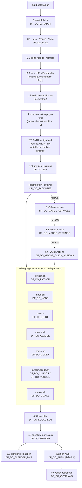

# Bootstrap flow

Step-by-step diagram of what `bootstrap.sh` actually does, with the `DF_DO_*` skip flag for each phase. Steps run in order — failures in any phase abort the rest (except VS Code/Cursor extension installs and a few other clearly-flagged log-warn-but-continue cases).

## Step details

| Step | Script | What | Idempotent? |
|---|---|---|---|
| 0 | `install/scratch.sh` | Symlink heavy `$HOME` dirs to `$DF_SCRATCH/.paths/`. No-op if `DF_SCRATCH` unset. | Yes |
| 0.1 | `install/dirs.sh` | Create `~/dev`, `~/bones`, `~/misc` (or `$DF_DIRS`). | Yes |
| 0.5 | inline | `git clone` if first run; `git pull --ff-only` in update/upgrade modes. | Yes |
| 0.3 | inline | Re-detect `PLAT` against the just-cloned repo's `install/plat/` dir. Upgrades the `PLAT` value if a higher CPU level matches now (e.g. v3 → v4). | Yes |
| 1 | `install/chezmoi.sh` | Download chezmoi to `$ARCH_BIN/chezmoi`. Skipped if file already executable. | Yes |
| 2 | (inline) | `chezmoi init --apply --force --exclude=scripts`. Renders `home/*.tmpl` into `~/`. `--exclude=scripts` skips `run_onchange_*.sh.tmpl` (bootstrap calls install scripts directly). | Yes |
| 2.7 | inline | Sanity-check that `$ARCH_BIN`, `$CARGO_HOME`, `$RUSTUP_HOME`, `$NVM_DIR` parents exist and aren't broken symlinks. Aborts if anything's wrong. | Yes |
| 3 | `install/zsh.sh` | Clone or update oh-my-zsh + plugins. | Yes |
| 4 | `install/homebrew.sh` (macOS) or `install/linux-packages.sh` | Install Homebrew, run `brew bundle install --file=Brewfile`, optionally `brew upgrade` and `brew upgrade --cask --greedy`. | Yes |
| 5 | `install/macos-services.sh` | Register Colima as a launchd service; symlink Docker plugins. macOS only. | Yes |
| 5.5 | `install/macos-settings.sh` | `defaults write` for Dock, Finder, keyboard, trackpad, Safari, iTerm2, screen lock. Power management requires sudo (silently skipped if cache expired). | Yes |
| 5.6 | `install/macos-quick-actions.sh` | Deploy `*.workflow` bundles to `~/Library/Services/`; flush `pbs`. | Yes |
| 6 | various | See language-runtime table below. Each script is independent; failures cascade only via `die` (not `log_warn`). | Yes |
| 6.5 | `install/local-llm.sh` + `install/opencode.sh` | Create `$LOCAL_PLAT/.cache/huggingface`; verify ollama/mlx-lm/mlx-openai-server/opencode binaries. | Yes |
| 6.6 | `install/memory.sh` | Agent memory stack: cass binary (checksum-verified GitHub release) + session-history index, ~/kb knowledge repo, qmd collections/embeddings, memory daemons. | Yes |
| 6.7 | `install/blender-mcp.sh` | Download `addon.py` into Blender's user addons; enable headlessly. Skipped if Blender not installed. | Yes |
| 7 | `install/auth.sh` | Walk every service, prompt `[k] keep / [u] update / [d] delete` per service. **Default off** — set `DF_DO_AUTH=1` to enable. | Yes |
| 8 | overlay scripts | Run `bash $DF_ROOT/dotfiles-*/bootstrap.sh "$DF_MODE"` for each overlay. | Per overlay |

## Step 6 in detail

| Sub-step | Script | What | Notes |
|---|---|---|---|
| 6a | `install/python.sh` | Install uv to `$ARCH_BIN`; `uv tool install` every entry in `pip.txt` (each gets isolated venv). | Runs before Node so node-gyp can use uv's Python. |
| 6b | `install/node.sh` | Install nvm to `$NVM_DIR`; install/upgrade Node v25; install `npm.txt` packages globally. | The parent bootstrap activates nvm before later agent/skill steps. |
| 6c | `install/rust.sh` | Install rustup; install/update stable plus the rust-docs MCP nightly; `cargo binstall --locked` every entry in `cargo.txt`. | Prebuilt first, source fallback; self-update only in upgrade mode. |
| 6d | `install/go.sh` | Install CLI tools from `go.txt` into `$ARCH_BIN`. | Go itself is owned by the Brewfile. |
| 6e | `install/claude.sh` | Download Claude Code; install plugins; register MCP servers; deploy overlay skills. | Atomic binary replacement. |
| 6f | `install/codex.sh` | Sync private config, hooks, rtk/chezmoi guards, MCP servers, and run the healthcheck. | The npm package is unpinned; the healthcheck catches config drift. |
| 6g | desktop scripts | Merge tracked Claude/Codex Desktop preferences on macOS. | Preserve app-owned state. |
| 6h | `install/cursor.sh` / `install/vscode.sh` | Sync Cursor MCP/settings and editor extensions. | Extension failures are warnings. |
| 6i | `install/cmake.sh` | Copy CMake toolchain files into `$LOCAL_PLAT/cmake/toolchains/`. | Always overwrites deployed copies. |

## Modes

| Mode | What changes |
|---|---|
| `install` (default) | Full idempotent setup. `DF_DO_SCRATCH=1` (run scratch step). |
| `update` | Same steps, but: `git pull --ff-only` in step 0.5, `DF_DO_SCRATCH=0` (assume scratch is already set up), tools self-update where they support it. |
| `upgrade` | Same as `update`, plus: `DF_BREW_UPGRADE=1` (greedy cask refresh), rustup self-update, `nvm install 25 --reinstall-packages-from=25 --latest-npm`, `npm install -g <pkg>@latest` per package, `uv self update + uv tool upgrade --all`, oh-my-zsh git pull, VS Code/Cursor extension `--force` reinstall. Claude Code and Codex CLI *always* re-download to latest regardless of mode. |

## Reading the source

The canonical source is `bootstrap.sh` itself — header comment block has the full flag table, then numbered `### N. ###` step markers. To trace what a single step *actually* does, jump to `install/<step>.sh`. Each install script sources `_lib.sh` for path variables and logging helpers.
