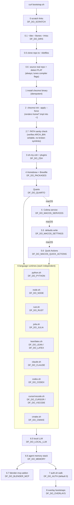

# Bootstrap flow

Step-by-step diagram of what `bootstrap.sh` actually does, with the `DF_DO_*` skip flag for each phase. Steps run in order — failures in any phase abort the rest (except VS Code/Cursor extension installs and a few other clearly-flagged log-warn-but-continue cases).

```mermaid
flowchart TD
    A[curl bootstrap.sh] --> S0["0  scratch links<br/>DF_DO_SCRATCH"]
    S0 --> S01["0.1  ~/dev ~/bones ~/misc<br/>DF_DO_DIRS"]
    S01 --> S05["0.5  clone repo to ~/dotfiles"]
    S05 --> S03["0.6  source real repo + detect PLAT<br/>(always; tunes compiler flags)"]
    S03 --> S1["1  install chezmoi binary<br/>(idempotent)"]
    S1 --> S2["2  chezmoi init --apply --force<br/>(renders home/*.tmpl into ~/)"]
    S2 --> S27["2.7  PATH sanity check<br/>(verifies ARCH_BIN writable, no broken symlinks)"]
    S27 --> S3["3  oh-my-zsh + plugins<br/>DF_DO_ZSH"]
    S3 --> S4["4  Homebrew + Brewfile<br/>DF_DO_PACKAGES"]
    S4 --> Q["Quarto<br/>DF_DO_QUARTO"]
    Q -.macOS.-> S5["5  Colima service<br/>DF_DO_MACOS_SERVICES"]
    S5 -.macOS.-> S55["5.5  defaults write<br/>DF_DO_MACOS_SETTINGS"]
    S55 -.macOS.-> S56["5.6  Quick Actions<br/>DF_DO_MACOS_QUICK_ACTIONS"]
    Q --> S6
    S56 --> S6
    subgraph S6["6  language runtimes  (each independent)"]
        P["python.sh<br/>DF_DO_PYTHON"]
        N["node.sh<br/>DF_DO_NODE"]
        R["rust.sh<br/>DF_DO_RUST"]
        J["julia.sh<br/>DF_DO_JULIA"]
        L["lean/latex.sh<br/>DF_DO_LEAN / DF_DO_LATEX"]
        C["claude.sh<br/>DF_DO_CLAUDE"]
        X["codex.sh<br/>DF_DO_CODEX"]
        V["cursor/vscode.sh<br/>DF_DO_CURSOR / DF_DO_VSCODE"]
        K["cmake.sh<br/>DF_DO_CMAKE"]
    end
    S6 --> S65["6.5  local LLM<br/>DF_DO_LOCAL_LLM"]
    S65 --> S66["6.6  agent memory stack<br/>DF_DO_MEMORY"]
    S66 --> S67["6.7  blender-mcp addon<br/>DF_DO_BLENDER_MCP"]
    S66 --> S7["7  auth.sh walk<br/>DF_DO_AUTH (default 0)"]
    S7 --> S8["8  overlay bootstraps<br/>DF_DO_OVERLAYS"]
```

## Step details

| Step | Script | What | Idempotent? |
|---|---|---|---|
| 0 | `install/scratch.sh` | Symlink heavy `$HOME` dirs to `$DF_SCRATCH/.paths/`. No-op if `DF_SCRATCH` unset. | Yes |
| 0.1 | `install/dirs.sh` | Create `~/dev`, `~/bones`, `~/misc` (or `$DF_DIRS`). | Yes |
| 0.5 | inline | `git clone` if first run; `git pull --ff-only` in update/upgrade modes. | Yes |
| 0.6 | inline | Re-source the cloned repo's `_lib.sh`, rebinding repo, overlay, PLAT, and platform-local paths authoritatively. | Yes |
| 1 | `install/chezmoi.sh` | Download chezmoi to `$ARCH_BIN/chezmoi`. Skipped if file already executable. | Yes |
| 2 | (inline) | `chezmoi init --apply --force --exclude=scripts`. Renders `home/*.tmpl` into `~/`. `--exclude=scripts` skips `run_onchange_*.sh.tmpl` (bootstrap calls install scripts directly). | Yes |
| 2.7 | inline | Sanity-check that `$ARCH_BIN`, `$CARGO_HOME`, `$RUSTUP_HOME`, `$NVM_DIR` parents exist and aren't broken symlinks. Aborts if anything's wrong. | Yes |
| 3 | `install/zsh.sh` | Clone or update oh-my-zsh + plugins. | Yes |
| 4 | `install/homebrew.sh` (macOS) or `install/linux-packages.sh` | Install Homebrew, run `brew bundle install --file=Brewfile`, optionally `brew upgrade` and `brew upgrade --cask --greedy`. | Yes |
| 4.5 | `install/quarto.sh` | Verify the macOS cask or install a checksum-verified rootless Linux release under `$LOCAL_PLAT`. | Yes |
| 5 | `install/macos-services.sh` | Register Colima as a launchd service; symlink Docker plugins. macOS only. | Yes |
| 5.5 | `install/macos-settings.sh` | `defaults write` for Dock, Finder, keyboard, trackpad, Safari, iTerm2, screen lock. Sudo-gated extras (skipped if sudo unavailable): power management, Touch ID for sudo (`/etc/pam.d/sudo_local`, with pam_reattach so it works in tmux), and a global 60-min sudo ticket (`/etc/sudoers.d/df-ticket`). | Yes |
| 5.6 | `install/macos-quick-actions.sh` | Deploy `*.workflow` bundles to `~/Library/Services/`; flush `pbs`. | Yes |
| 6 | various | See language-runtime table below. Each script is independent; failures cascade only via `die` (not `log_warn`). | Yes |
| 6.5 | `install/local-llm.sh` + `install/opencode.sh` | Create `$LOCAL_PLAT/.cache/huggingface`; verify ollama/mlx-lm/mlx-openai-server/opencode binaries. | Yes |
| 6.6 | `install/memory.sh` | Agent memory stack: cass binary/archive setup (indexing is manual), ~/kb knowledge repo, qmd collections/embeddings, qmd daemon. | Yes |
| 6.65 | `install/skills-sync.sh` | Install agent skills from `agent-skills.txt` into the shared `~/.claude/skills` tree. | Yes |
| 6.7 | `install/blender-mcp.sh` | Download `addon.py` into Blender's user addons; enable headlessly. Skipped if Blender not installed. | Yes |
| 7 | `install/auth.sh` | Walk every service, prompt `[k] keep / [u] update / [d] delete` per service. **Default off** — set `DF_DO_AUTH=1` to enable. | Yes |
| 8 | overlay scripts | Run `bash $DF_ROOT/dotfiles-*/bootstrap.sh "$DF_MODE"` for each overlay. | Per overlay |

## Step 6 in detail

| Sub-step | Script | What | Notes |
|---|---|---|---|
| 6a | `install/python.sh` | Install uv to `$ARCH_BIN`; install `pip.txt` plus `pip-full.txt` when `DF_PROFILE=full` (each tool gets an isolated venv). | Runs before Node so node-gyp can use uv's Python. |
| 6b | `install/node.sh` | Install pinned nvm; install/upgrade Node 24 LTS; install `npm.txt` packages globally. | The parent bootstrap activates nvm before later agent/skill steps. |
| 6c | `install/rust.sh` | Install rustup and rust-analyzer; in the full profile, install the rust-docs MCP nightly and every entry in `cargo.txt`. | Prebuilt first, host-target source fallback; self-update only in upgrade mode. |
| 6d | `install/go.sh` | Install CLI tools from `go.txt` into `$ARCH_BIN`. | Go itself is owned by the Brewfile. |
| 6e | `install/julia.sh` | Install/default Juliaup's release channel in PLAT-isolated depots. | Upgrade mode runs `juliaup update release`. |
| 6f | `install/lean.sh` | Install elan to `$ELAN_HOME`; install and default the pinned Lean toolchain. | Pin moves only alongside Mathlib; upgrade updates elan, not exact project pins. |
| 6g | `install/latex.sh` | macOS: verify MacTeX. Linux: install TinyTeX below `$LOCAL_PLAT`, route `sys_bin` into `$ARCH_BIN`, and install baseline packages. | Upgrade mode runs `tlmgr update --self --all`. |
| 6h | `install/claude.sh` | Download Claude Code; install plugins; register MCP servers; deploy overlay skills. | Atomic binary replacement. |
| 6i | `install/codex.sh` | Sync private config, hooks, guards, risk-scoped MCP servers, and run the healthcheck. | The healthcheck parses every profile and hook trust entry. |
| 6j | desktop scripts | Merge tracked Claude/Codex Desktop and LinearMouse settings on macOS. | Preserve app-owned state. |
| 6k | `install/cursor.sh` / `install/vscode.sh` | Sync Cursor MCP/settings and editor extensions. | Extension failures are warnings. |
| 6l | `install/cmake.sh` | Copy CMake toolchain files into `$LOCAL_PLAT/cmake/toolchains/`. | Always overwrites deployed copies. |

## Modes

| Mode | What changes |
|---|---|
| `install` (default) | Full idempotent setup. `DF_DO_SCRATCH=1` (run scratch step). |
| `update` | Same steps, but: `git pull --ff-only` in step 0.5, `DF_DO_SCRATCH=0` (assume scratch is already set up), tools self-update where they support it. |
| `upgrade` | Same as `update`, plus Homebrew, rolling Rust channels/Cargo tools, Go `@latest` tools, Node 24/npm 12 globals, uv tools, Julia release, TeX, and editor refreshes. It ends with `audit-versions.sh --strict`. |

## Reading the source

The canonical source is `bootstrap.sh` itself — header comment block has the full flag table, then numbered `### N. ###` step markers. To trace what a single step *actually* does, jump to `install/<step>.sh`. Each install script sources `_lib.sh` for path variables and logging helpers.
