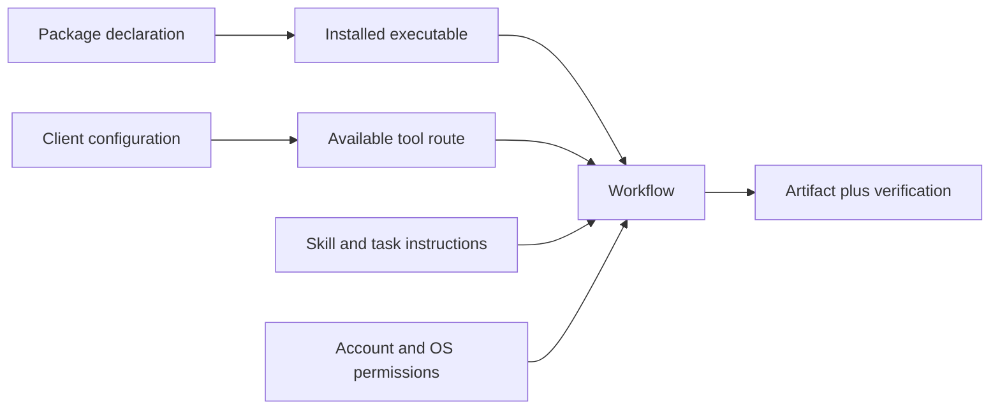

import CatalogChart from '@components/CatalogChart.astro';

The setup contains several different kinds of declaration. A package installs software; a skill teaches a workflow; a plugin bundles capabilities; an MCP entry configures a tool connection. Keeping these categories distinct prevents duplicate ownership and misleading capability counts.

## Ownership at a glance

<CatalogChart />

## Explore the live reference

- [Package catalog](/reference/packages/): search by tool, owner, platform, profile, or source path.
- [Skill catalog](/reference/skills/): distinguish repository-owned procedures from installer-managed skills.
- [MCP catalog](/reference/mcp/): inspect declared transports, profiles, and mutation risk.
- [Feature map](/reference/features/): trace installers and runtime helpers to operating guides and checks.

## From declaration to useful capability

The catalogs report configured intent from the public source tree. An entry is not proof of installation, a signed-in account, an available device, or a successful task. Use the [agent inventory guide](/agents/inventories/) and [validation guide](/agents/validation/) to close those gaps on the actual host.

## Why the counts can change

Each build reads the current repository manifests and skill metadata. Package additions appear automatically, while a new installer or runtime helper must also receive an explicit feature-map entry. Renames and removals should update both the source and its related guide. See [maintaining documentation](/contributing/documentation/).
