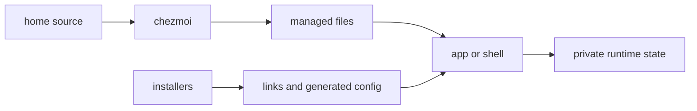

## Read this map before editing a live file

Find a setting below, edit its repository source, then preview and apply. For example:

```sh title="Locate and preview Neovim configuration"
chezmoi source-path ~/.config/nvim/init.lua
chezmoi diff ~/.config/nvim/init.lua
```

The first command identifies ownership; the second shows pending changes without applying them.



After applying, reload the app or open a new shell. Private runtime state—tokens, caches, databases, and sessions—stays separate from managed settings.

## Source-to-target families

| Family | Authoritative sources | Rendered or installer target | Separate state and handbook |
| --- | --- | --- | --- |
| Chezmoi identity/data | [templates](../../home/.chezmoitemplates/), [data](../../home/.chezmoidata.toml) | $HOME/.config/chezmoi and rendered templates | Machine data controls templates; inspect with chezmoi data. |
| <a id="shells" href="#shells">Shells</a> | [zprofile](../../home/dot_zprofile.tmpl), [bash profile](../../home/dot_bash_profile.tmpl), [zshrc](../../home/dot_zshrc.tmpl), [bashrc](../../home/dot_bashrc.tmpl), [profile](../../home/dot_profile.tmpl), [inputrc](../../home/dot_inputrc), [Fish](../../home/dot_config/fish/conf.d/) | .config/fish/conf.d, .zprofile, .bash_profile, .zshrc, .bashrc, .profile, .inputrc | Environment/history/plugins; [guide](../workflows/shell-editor-terminal.md). |
| <a id="terminals" href="#terminals">Terminals</a> | [Ghostty](../../home/dot_config/ghostty/config), [tmux](../../home/dot_tmux.conf), [iTerm](../../home/dot_iterm2/) | Ghostty config, .tmux.conf, iTerm preferences | SSH terminfo, tmux server, clipboard access. |
| Search/directories | [ripgrep](../../home/dot_config/ripgrep/ripgreprc), [Git ignore](../../home/dot_config/git/ignore) | ripgrep and Git config dirs | Project-local ignore files remain effective. |
| <a id="git-ssh" href="#git-ssh">Git & SSH</a> | [gitconfig](../../home/dot_gitconfig.tmpl), [SSH config](../../home/dot_ssh/config.tmpl) | .gitconfig, .ssh/config | Keys, known hosts, private config.d, server policy. |
| <a id="neovim" href="#neovim">Neovim</a> | [init.lua](../../home/dot_config/nvim/init.lua) | .config/nvim/init.lua | lazy.nvim, Mason packages, LSP, Treesitter. |
| <a id="editors" href="#editors">VS Code & Cursor</a> | [VS Code settings](../../home/dot_config/vscode/settings.json), [Cursor settings](../../home/dot_config/cursor/), [Cursor hooks](../../home/dot_cursor/) | config dirs, native User links, .cursor/hooks.json | Extensions, Remote-SSH, GUI reload, Cursor MCP JSON. |
| <a id="agents" href="#agents">Agents</a> | [Codex](../../home/dot_codex/), [Claude](../../home/dot_claude/), [OpenCode](../../home/dot_config/opencode/), [Pi](../../home/dot_pi/) | .codex, .claude, OpenCode, Pi dirs | Plugin caches, MCP processes, auth; [guides](../agents/README.md). |
| Local helpers | [bin helpers](../../home/dot_local/bin/) | .local/bin | Process/browser/desktop permission and task/archive state; [durable work](../agents/durable-work.md). |
| Desktop/launchd | [AeroSpace](../../home/dot_aerospace.toml), [LaunchAgents](../../home/Library/LaunchAgents/) | .aerospace.toml, Library/LaunchAgents | Loaded jobs and running applications. |
| Lifecycle hooks | [run_onchange sources](../../home/) | Executed by chezmoi during apply | Installer results and generated state have their own boundaries. |

`dot_` becomes a leading dot; `.tmpl` renders using machine data. `create_` files are write-once inputs: their reconciler preserves runtime-owned sections.

## SSH agent forwarding policy

The managed [SSH config](../../home/dot_ssh/config.tmpl) reads
`~/.ssh/config.d/*` before its `Host *` defaults. Keep destination trust
decisions in an uncommitted file rather than changing the shared template. For
example, allow only `buildbox` to use the local agent:

```sh title="Create a private forwarding policy"
mkdir -p ~/.ssh/config.d
chmod 700 ~/.ssh ~/.ssh/config.d
${EDITOR:-vi} ~/.ssh/config.d/forwarding
chmod 600 ~/.ssh/config.d/forwarding
```

Put this in `~/.ssh/config.d/forwarding`:

```sshconfig
# Trusted destinations.
Host buildbox
    ForwardAgent yes

# Disable forwarding for every other destination.
Host *
    ForwardAgent no
```

OpenSSH uses the first obtained value for an option, so the named host's `yes`
and the private catch-all `no` take effect before the template's current global
`ForwardAgent yes`. If `$HOME` is shared over NFS, this file is shared too, so
the policy applies on every machine using that home. Different machine policies
require a genuinely host-local overlay/include or host-selected rules such as
`Match exec`; this configuration does not create that isolation automatically.
Any matching `ForwardAgent` setting from an earlier `config.d` file can also
win, so check the effective value after changing includes. Agent forwarding
lets a remote host use your local agent while the connection is open; enable it
only for hosts you trust. See the [OpenSSH
`ssh_config` reference](https://man.openbsd.org/ssh_config#ForwardAgent).

Check the resolved value without connecting:

```sh title="Verify the host policy"
ssh -G buildbox | grep '^forwardagent '
ssh -G an-untrusted-host | grep '^forwardagent '
```

The expected output is `forwardagent yes` for `buildbox` and `forwardagent no`
for other hosts. `ssh -G` reports client configuration only; it does not test
network reachability, authentication, or the remote server.

## Operator recipes

| Goal | Read-only evidence | Establishes |
| --- | --- | --- |
| Find target source | chezmoi source-path $HOME/.config/nvim/init.lua | Chezmoi ownership and source path. |
| Preview a change | chezmoi diff | Render delta; no target changed. |
| Check template values | chezmoi data | Current chezmoi data. |
| Inspect native editor link | ls -l native User settings target | Link destination, not editor reload/extensions. |
| Inspect SSH options | ssh -G host | Client resolution, not connection/authentication. |
| Inspect Git origin | git config --global --show-origin --get core.editor | Selected config file and value. |

After a change, check its consumer: Neovim `:checkhealth`, an editor's extension list, or a fresh login shell.

## Ownership boundaries that prevent drift

Package manifests own installable tools and editor extensions; home owns settings and executable helper sources; installers own platform-native links and generated runtime configuration. The [feature map](feature-map.md) inventories installers/helpers. [Agent inventories](../agents/inventories.md) explain skills, plugins, and MCP ownership without duplicating every declaration here.

Do not commit private SSH host blocks, credential env files, application databases, browser profiles, plugin caches, or editor remote-server state. For template semantics, use [chezmoi machine differences](https://www.chezmoi.io/user-guide/manage-machine-to-machine-differences/) and [source-state attributes](https://www.chezmoi.io/reference/source-state-attributes/).
