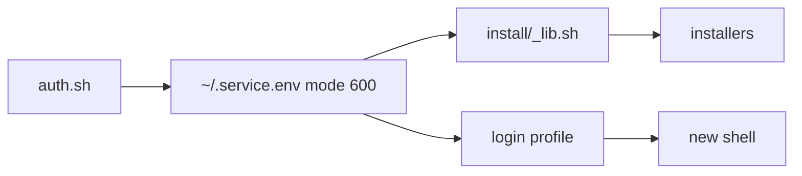

# Authentication

`install/auth.sh` creates owner-only `~/.<service>.env` files for optional API
workflows. It is not required for a normal bootstrap: leave a service empty
until a selected tool needs it.

## Quick reference

```sh
bash ~/dotfiles/install/auth.sh           # guided walk
bash ~/dotfiles/install/auth.sh status    # read-only status
bash ~/dotfiles/install/auth.sh github    # one service
bash ~/dotfiles/install/auth.sh gh        # browser login for GitHub CLI
DF_DO_AUTH=1 ~/dotfiles/bootstrap.sh      # include the walk in bootstrap
```

Expected result: token values are masked; a new login shell receives the
configured exports. See [bootstrap](/setup/bootstrap/) for the stage and
[agent setup](/agents/) for the tools that consume credentials.

## Service registry

The authoritative, current registry is `_SERVICE_DEFS` in
[`install/auth.sh`](../../install/auth.sh). It includes common GitHub,
Anthropic, OpenAI, Cloudflare, and Hugging Face workflows plus optional research,
search, mail, audio, GitLab, and Google integrations. Use `auth.sh help` or
`status` rather than copying a partial service list into a machine record.

| Need | Usual path | Keep empty when |
| --- | --- | --- |
| GitHub API/rate limits | `github` or `gh` | public, low-volume work is enough |
| Provider SDK/API mode | the named provider | using the provider's interactive login only |
| Gemini API and Live | `gemini` | only using Gemini CLI with Google login |
| Gemini CLI Google login | `gemini-cli` | only using the Developer API |
| Google auth inventory | `google-status` | read-only; useful before choosing a project |
| Deployment, MCP, or project service | the named service | that workflow is not selected |

`gh auth login` stores its credential in the system keychain or secret service;
it is separate from `~/.github.env` and is used by the GitHub MCP flow.

See [Gemini and Google APIs](/usage/google-ai/) for separate CLI, Developer API,
Vertex/ADC, and Workspace paths, SDK packages, Live probes, quotas and pricing.

## How tokens get loaded



Open a new shell after a change, or source the specific env file for the
current shell. The helper masks input and status output.

## Per-prompt UX

For each service the walk shows its creation URL, requested scope, file, and a
reason it is safe to skip. Existing entries can be kept, updated, or deleted;
empty entries can be skipped. The final tally reports those actions without
printing tokens.

## The `gh`-derive trick (GITHUB_TOKEN)

If the GitHub CLI is already logged in, choose the helper's `G` option or use:

```sh
# ~/.github.env
export GITHUB_TOKEN="$(gh auth token 2>/dev/null)"
```

This avoids a second token and tracks `gh auth refresh` automatically.

## Adding a new service

Add one `name|ENV_VAR|.env_file|description|create_url|scopes|skip_if` row to
`_SERVICE_DEFS` in [`install/auth.sh`](../../install/auth.sh), then run
`bash install/auth.sh status`. The row drives the single-service command and
the guided walk.

## File security

The helper writes env files with mode `600`, never prints a plaintext token,
and removes an empty file after deletion. Keep these files out of repositories,
screenshots, and shareable knowledge bases.

## SSH agent forwarding

Forward your local SSH agent only to trusted hosts that need to authenticate
onward, for example when running Git on a remote workstation. The managed
[`SSH template`](../../home/dot_ssh/config.tmpl) defaults to `ForwardAgent no`.
Keep private host names in an overlay's `ssh/config`, not in this public repo:

```sshconfig
# ~/dotfiles/dotfiles-work/ssh/config (private repository)
Host trusted-workstation trusted-workstation.example.com
    ForwardAgent yes
```

SSH reads `~/.ssh/config.d/*` first, then `<dotfiles>/dotfiles-*/ssh/config`
in lexical order, then public defaults. OpenSSH uses the first matching value,
so local includes can opt a host out with `ForwardAgent no`. An absent overlay
is harmless and does not enable forwarding. The overlay must remain checked
out; its configuration is read directly, not copied into the public config.

```sh
chezmoi diff -- ~/.ssh/config
chezmoi apply -- ~/.ssh/config
ssh -G trusted-workstation | grep '^forwardagent '  # yes with the private entry
ssh -G unrelated.example | grep '^forwardagent '   # no with the example above
ssh-add -l                                        # local agent has an identity
ssh -o ControlPath=none trusted-workstation 'test -S "$SSH_AUTH_SOCK" && ssh-add -l'
```

The final command checks a fresh connection without disrupting existing
multiplexed sessions. Old master connections retain their original agent;
reconnect desktop/terminal sessions when needed. Explicit `ssh -A`/`ssh -a`
flags override configuration; clients using a different `-F` file must include
these settings themselves. For an interactive multi-hop chain, install the
policy on each machine that initiates the next SSH connection. Receiving a
forwarded agent lets a host authenticate onward; forwarding it again makes it
available to processes on the next host. Do not copy private keys or persist
`SSH_AUTH_SOCK` in shared host configuration.

An overlay can deliberately opt the whole client into forwarding:

```sshconfig
# At the end of the private overlay's ssh/config, after specific exceptions.
Host *
    ForwardAgent yes
```

This matches every destination, including external hosts, short aliases, and
IP addresses; it does not identify which organization owns the destination.
The same local `~/.ssh/config.d/*` opt-outs still take precedence. Removing the
overlay returns to the public default on new connections.

Forwarding exposes signing access, not private key files. Administrators or
compromised processes on the destination can use the forwarded agent while
connected. A wildcard is a deliberate broader-trust choice, not a requirement
for Git authentication or a statement of organizational approval. Prefer
scoped rules or `ProxyJump` where that broader access is unnecessary. See
[OpenSSH's ForwardAgent and ControlMaster reference](https://man.openbsd.org/ssh_config).
