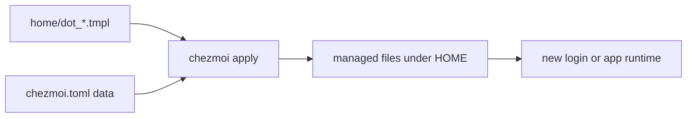

# Managing dotfiles

[chezmoi](https://chezmoi.io) renders `home/` into the home directory. Edit the
source, preview the rendered result, then apply; a rendered target is not the
durable source of truth.

## Data flow



Templates render at apply time. Name, email, and setup choices are cached in
`~/.config/chezmoi/chezmoi.toml`; bootstrap prompts only when required values
are missing.

## The quick version

```sh
chezmoi edit ~/.zshrc       # edit source only
chezmoi edit ~/.zshrc --apply  # edit source, then apply after editor exit
chezmoi diff                # inspect pending rendered changes
chezmoi apply               # deploy all pending changes
chezmoi update              # update source and apply
```

After a login-profile change, open a new login shell (`exec zsh -l`) before
judging runtime behavior.

## How files map

| Source | Target |
| --- | --- |
| `home/dot_zshrc.tmpl` | `~/.zshrc` |
| `home/dot_zprofile.tmpl` / `dot_bash_profile.tmpl` | login profiles |
| `home/dot_config/...` | `~/.config/...` |
| `home/dot_ssh/config.tmpl` | `~/.ssh/config` |
| `home/dot_claude/`, `home/dot_codex/` | agent configuration |

`dot_` maps to a leading dot and `.tmpl` means a Go template. Browse
[`home/`](../../home/) for the complete source tree.

## Template variables

| Variable | Meaning |
| --- | --- |
| `.name`, `.email` | first-bootstrap identity values |
| `.use_plat` | shared-home runtime layout choice |
| `.chezmoi.os` | stable operating-system branch |
| `.chezmoi.username`, `.chezmoi.homeDir` | observed local identity/path |

Use per-machine facts at shell runtime when the target file is shared. See
[PLAT isolation](/setup/plat/) for the layout contract.

## Editing dotfiles

```sh
# direct source workflow
${EDITOR:-vi} ~/dotfiles/home/dot_zshrc.tmpl
chezmoi diff
chezmoi apply
exec zsh -l
```

`chezmoi edit ~/.zshrc --apply` is the target-based equivalent of this
workflow; `--watch` applies each saved edit. Plain `chezmoi edit` changes only
the source. Do not edit
`~/.zshrc`, `.zprofile`, or `.bash_profile` directly: the next apply replaces
the change.

## Shared home directory safety

All machines sharing a home write the same target files. Do not render an
architecture-specific template value into those files; evaluate it when the
shell starts instead:

```sh
# stable template; runtime chooses the current machine
export PATH="$HOME/.local/$(uname -m)-$(uname -s)/bin:$PATH"

# unsafe in a shared target: each host rewrites a different value
# export PATH="$HOME/.local/{{ .chezmoi.arch }}/bin:$PATH"
```

Existing templates may branch by OS where that is an intentional deployment
boundary. Keep cross-host executable isolation in the runtime path helper.

## Multi-machine sync

```sh
# source machine: edit, preview, apply, then publish through normal Git workflow
chezmoi diff && chezmoi apply

# each other machine: refresh its own local target
chezmoi update
```

`chezmoi apply` affects only the machine where it runs. For a one-off render,
use `chezmoi execute-template < source.tmpl` and copy the result deliberately.

## Files that other tools also write

Treat these as managed/configuration boundaries: editor settings, agent config,
and shell profiles may be linked or updated by their matching installer after
chezmoi applies the source. Inspect `chezmoi diff` and the relevant installer
before resolving a conflict by hand. See [configuration recipes](/workflows/configuration-recipes/)
and [troubleshooting](/usage/troubleshooting/) for repeatable diagnosis.
