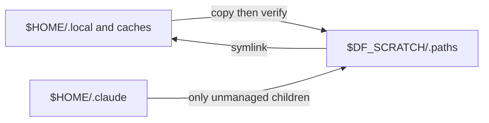

# Scratch space

Use scratch only when a shared or quota-limited home cannot hold build caches,
tool runtimes, and bulk data. Bootstrap moves selected state into
`$DF_SCRATCH/.paths`, verifies the copy, then replaces the original path with a
symlink. A normal home needs none of this.

## How it works



| Path class | Default treatment | Why |
| --- | --- | --- |
| `.local`, `.cache`, `.cass`, `.npm`, editor/server state | move whole selected directory | large derived/runtime state |
| `~/kb` | move whole directory | local index locality; use its Git remote to sync |
| `.claude`, `.codex`, `.config` | remain real directories | chezmoi manages entries inside them |
| `.ssh`, `~/dotfiles` | never move | security and source-of-truth boundaries |

If a copy cannot be verified, the source remains in place. A conflicting
symlink is reported and left untouched. See [`install/scratch.sh`](../../install/scratch.sh)
for the exact defaults.

### Codex specifics

The scratch installer no longer relocates Codex files. Existing links remain
intact as recovery input; it neither deletes old databases nor repairs them
while another host might be writing them. See
[Codex host-local state](../agents/codex.md#host-local-state).

SQLite WAL requires database users to be on the same host. Shared scratch is
still shared storage. Moving individual database files can also break Codex
recovery when its backup rename crosses filesystems. See
[SQLite's WAL limitations](https://sqlite.org/wal.html).

### Why not `CODEX_HOME`?

`CODEX_HOME` is now the supported runtime boundary. A configured
`DF_STATE_ROOT` selects a real host-local `$DF_STATE_ROOT/codex`; the installer
projects managed configuration there. Login shells and agent launchers resolve
the same host inputs. Launches that deliberately bypass that environment must
provide `CODEX_HOME` explicitly. Ordinary local homes still use `~/.codex`.

### Why not symlink the whole dir and `.chezmoiignore` it?

Ignoring the whole directory would transfer chezmoi's create-once, private-mode,
executable-bit, and template duties to an installer. The small managed portion
does not justify that drift risk.

## Configuring

```sh
# explicit scratch root
DF_SCRATCH=/scratch/$USER ~/dotfiles/bootstrap.sh

# or let bootstrap discover this link
ln -s /local/disk/$USER ~/scratch
~/dotfiles/bootstrap.sh
```

| Variable | Default | Purpose |
| --- | --- | --- |
| `DF_SCRATCH` | unset | scratch root; enables the feature |
| `DF_SCRATCH_LINK` | `~/scratch` | discovered/created pointer to the root |
| `DF_LINKS` | installer default | colon-separated top-level directories |
| `DF_CONFIG_LINKS` | `Code` | selected `~/.config` children |
| `DF_CURSOR_LINKS` | `projects:worktrees` | selected `~/.cursor` children |
| `DF_CLAUDE_LINKS` | installer defaults | unmanaged Claude-directory children |
| `DF_DO_SCRATCH` | install: `1`; update/upgrade: `0` | skip scratch setup |

Set a links variable to an empty value to skip its group. Review the current
defaults in [`install/scratch.sh`](../../install/scratch.sh) before overriding.

The shipped lists are deliberately explicit:

```text
DF_LINKS=$HOME/.local:$HOME/.cache:$HOME/.cass:$HOME/.vscode:$HOME/.vscode-server:$HOME/.cursor-server:$HOME/.nv:$HOME/.npm:$HOME/.oh-my-zsh:$HOME/.oh-my-zsh-custom:$HOME/kb:$HOME/.computelab:$HOME/.agent-browser:$HOME/.gradle
DF_CLAUDE_LINKS=projects:plugins:file-history
```

`~/.cursor` itself stays real, but its default `projects:worktrees` children
move through `DF_CURSOR_LINKS`.

## What NOT to symlink

Never link all of `~/.claude`, `~/.codex`, or `~/.config`: a later chezmoi
apply can replace the directory and orphan the moved state. Do not move
`~/.ssh` or the checkout. Use the supported child-list variables instead.

## Filesystem caveats

tmpfs loses data on reboot; cross-filesystem first runs can be slow; NFS can
leave `.nfs*` files that require later cleanup. Redirected state is only as
local as its target filesystem: NFS scratch remains shared across hosts.
Use Git or another explicit synchronization mechanism for durable knowledge.

## Re-running

The installer is idempotent: correct links are retained and new real-directory
contents are migrated after verification. To stop new setup work, run:

```sh
DF_DO_SCRATCH=0 ~/dotfiles/bootstrap.sh
```

There is no automatic rollback. Move data back deliberately after inspecting
the exact links.
