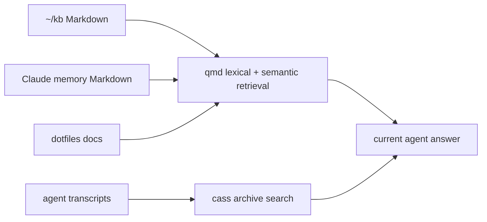

## Choose the layer that owns the fact

The setup separates current task context, durable Markdown knowledge, and archived session history. They answer different questions and have different synchronization and privacy properties.

| Layer | Source of truth | Query path | Synchronizes? |
| --- | --- | --- | --- |
| L1 task memory | Native harness state and its own memory files | Current task/client | Per-machine client state |
| L2 knowledge base | `~/kb` Markdown plus selected docs/memory collections | qmd CLI or local MCP | Markdown can sync through its Git remote; indexes do not |
| L3 session archive | Harness transcripts retained under `~/.cass` | cass CLI and `history-search` | No; preserve it as an archive |

`install/memory.sh` configures qmd collections for `~/kb`, Claude auto-memory Markdown, and dotfiles documentation. qmd maintains a local query service; cass indexing is explicitly manual because transcript archives can be large. Neither command should be treated as a casual cleanup target.



## Search qmd, then retrieve the source

The installed qmd workflow requires retrieval after a search hit. Exact titles, symbols, and rare phrases are lexical-search cases; indirect concepts benefit from a structured query written with explicit intent and vocabulary.

```bash
# Read-only discovery. It lists configured collections and service/index state.
qmd collection list
qmd status

# Exact lookup, followed by retrieval of the complete cited document.
qmd search 'Codex MCP profiles' -n 5
qmd get '#docid:120:40'
```

Replace `#docid` with a result identifier. `qmd get` returns line-numbered content by default, so retain the document identity and lines with any claim. Use `qmd multi-get` for a comparison. Do not pipe `qmd get` through line slicers; request the range through its `:from:count` suffix instead.

For a conceptual query, write the search intent rather than relying on automatic expansion:

```bash
qmd query $'intent: Find the documented decision about a minimal Codex MCP baseline, not generic tool setup.\nlex: Codex MCP profile baseline\nvec: a focused default tool inventory with opt-in domain profiles'
```

`qmd search`, `query`, `get`, `collection list`, `status`, and `doctor` are diagnostic/query operations. `qmd collection add`, `update`, and `embed` mutate local configuration or indexes and require explicit maintenance authorization.

## Use cass as evidence from prior sessions

Cass indexes coding-agent transcripts across the configured harnesses. It can recover a prior decision or command when the current project state needs context, but an indexed transcript is historical evidence: verify drift-prone facts against current code, configuration, or primary sources.

```bash
# Availability and diagnostic checks; neither refreshes an index.
cass --version
cass doctor
```

`install/memory.sh index` refreshes the lexical archive. `semantic` processes one configured bounded semantic batch; `reindex` forces qmd embedding and cass lexical rebuilding. Those are maintenance operations and are deliberately absent from ordinary task startup. On macOS, the script bounds Aider discovery to `~/dev` unless configured otherwise, rather than walking the entire home directory.

## Keep state and evidence separate

The qmd index is rebuildable from its Markdown collections and remains local to the host. `~/kb` is the shareable source layer; put durable decisions, notes, and reusable snippets there and commit it as appropriate. Cass is not merely a cache: it may contain transcripts no longer retained by a harness, so its archive path is deliberately `~/.cass` even when scratch storage redirects it physically.

Do not place credential exports, browser storage-state files, or unrelated private task artifacts in `~/kb` just to make them searchable. A query result establishes that indexed text exists; it does not establish a current account grant, a live deployment, or the correctness of an old decision.

After an authorized setup or toolchain update, `df-agent-doctor` can check declared qmd/cass components and the live qmd daemon. It cannot prove that a semantic query is useful, that every transcript was indexed, or that a remote knowledge repository is synchronized.

Use the installed qmd skill for version-matched search syntax; its installer ownership and discovery path are documented in the [skills handbook](../agents/skills.md). Keep the [AI workbench](../usage/ai-workbench.md) as the operational entry point for intentional `memory.sh` maintenance.
